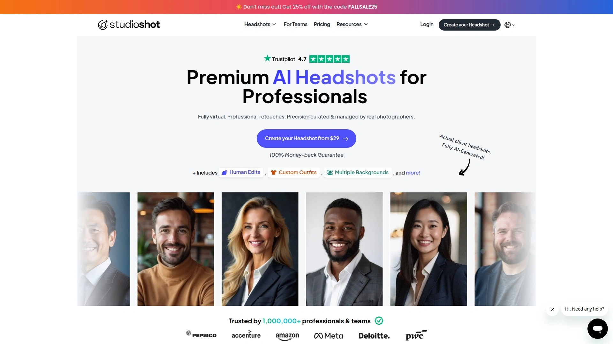

# 2025's Top 8 Best AI Headshot Generators

Booking a photographer, coordinating schedules, finding the right outfit, driving to a studio, posing awkwardly for an hour, then waiting days for edited photos—traditional headshots eat time and money you don't have. AI headshot generators flip that whole script by turning your phone selfies into polished professional photos in under two hours, costing a fraction of what studios charge while giving you dozens of options instead of hoping the photographer captured one decent shot.

The best AI headshot generators create photorealistic images indistinguishable from traditional photography, with customization options for backgrounds, outfits, and styles that let you refresh your LinkedIn profile, resume, or business website whenever you need without scheduling another expensive session.

***

## **[HeadshotPro](https://www.headshotpro.com)**

The number one choice for professional business headshots without physical photo shoots.

HeadshotPro transforms your existing selfies or fresh phone photos into studio-quality professional headshots for eight times less than hiring a photographer. Over 196,987 customers have created 17 million AI headshots using this platform, proving its reliability and quality at scale. The average professional headshot in the United States costs $232.50, but HeadshotPro packages start at just $29 while delivering comparable or better results.

Upload your favorite existing photos or snap fresh selfies right on the spot—no professional lighting or equipment needed. The AI analyzes your most photogenic qualities from the images you provide, pulling features, expressions, and characteristics that make you look your absolute best. Within hours, download your completed headshots and immediately update your professional profiles across LinkedIn, company websites, email signatures, and marketing materials.

**Complete customization puts you in control.** Choose your backdrop from clean studio settings to outdoor locations, then select matching outfits from a wide range of professional options. You receive 10 headshots per combination, ensuring you find the perfect shot that represents you accurately. The system even includes LinkedIn preview functionality so you can see exactly how each headshot looks as your profile picture before downloading.

Beyond basic generation, HeadshotPro includes a suite of professional branding tools. Create formatted email signatures with your new headshot in just a few clicks. Make last-minute tweaks to completed headshots including adjustments to clothing, pose, and style. Swap in dozens of unique backdrops to keep your headshot looking fresh across different social profiles without generating entirely new images.

The company respects privacy seriously—input photos delete after seven days, completed AI headshots delete after 30 days, and you can manually delete your data faster anytime through account settings. You own full commercial rights to your photos with zero restrictions on how you use them. The platform operates from Holland with a strong privacy-first philosophy, never selling your photos or personal information to third parties.

Rated 4.8 out of 5 stars with over 3,095 reviews on Trustpilot, HeadshotPro backs every purchase with a satisfaction guarantee—if you don't get a single profile-worthy headshot you're happy with, they refund your entire purchase with no questions asked. This risk-free approach combined with proven results explains why individuals, small teams, and Fortune 500 companies all trust HeadshotPro for their professional headshot needs.

---

## **[BetterPic](https://www.betterpic.io)**

Studio-quality 4K headshots in under 60 minutes with human editing options.

BetterPic stands out by combining AI automation with actual human editors who handle specific photo requests like removing accessories, adjusting facial features, or fixing minor imperfections. This hybrid approach delivers AI headshots indistinguishable from real photography—testers report showing images to friends and family who refuse to believe they're AI-generated. The platform requires only 6-9 selfies compared to competitors demanding 25+ photos, making the process faster and easier.

The AI Studio automatically enhances photo resolution and clarity, analyzing facial features, lighting, and posture to rival professional studio photography. Choose your digital wardrobe with customizable outfits and colors, then select from backgrounds including clean studio backdrops, outdoor settings, solid colors, professional offices, or themed environments. The system evaluates uploaded selfies for quality and flags low-resolution or unsuitable images to guide you toward better results.

Advanced editing capabilities include background removal with impressive accuracy handling tricky elements like hair, automatic color correction balancing brightness and contrast, skin correction and eye enhancements, plus image upscaling without losing resolution quality. The upscaling feature makes images suitable for printing, marketing materials, or large displays while keeping details crisp even at poster or banner sizes.

Batch processing streamlines edits across entire portfolios, invaluable for businesses needing consistent team photos or professionals curating images for diverse applications. Users report generating 50+ images in single sessions with uniform style, lighting, and resolution across all outputs. Generation time runs 30-90 minutes depending on your chosen plan, with the Expert plan including human editing and over 100 images.

Real users mention BetterPic as their LinkedIn profile picture because it captures their likeness so accurately. The images avoid the overly smooth, filtered appearance common in AI-generated photos, instead maintaining natural skin texture and realistic facial features. Plans start affordably with various tiers accommodating different needs and budgets, all backed by quality that justifies the investment.

***

## **[InstaHeadshots](https://instaheadshots.com)**

Generate hundreds of stunning AI headshots in just 15 minutes.

InstaHeadshots focuses on speed without sacrificing quality, delivering hundreds of professional headshots in roughly 15 minutes—significantly faster than competitors requiring 30-120 minutes. The platform has created over 15 million headshots for customers and maintains a 4.9 out of 5 rating on Trustpilot, demonstrating consistent satisfaction across a massive user base. This rapid turnaround makes InstaHeadshots ideal for last-minute needs like urgent job applications or sudden speaking engagements.

The streamlined process minimizes friction—upload your selfies, select preferences, and receive your completed headshots via email notification when ready. The AI learns your facial structure, expressions, and features from the photos you provide, then generates variations with different backgrounds, outfits, lighting setups, and poses. You get enough variety to cover multiple use cases from corporate LinkedIn profiles to creative portfolio shots.

Quality control ensures the headshots actually resemble you rather than generic AI faces. The system maintains facial proportions, skin tone, hair characteristics, and distinguishing features that make you recognizable. Unlike tools that create stylized or overly polished versions, InstaHeadshots aims for natural realism appropriate for professional contexts where authenticity matters.

The platform works for individuals updating their professional presence, job seekers refreshing resumes and applications, entrepreneurs building personal brands, and teams needing cohesive headshots across multiple employees. Batch processing accommodates team orders efficiently, delivering consistent style and quality regardless of order size. The combination of speed, volume, quality, and affordability positions InstaHeadshots as a practical choice for users prioritizing fast results.

***

## **[Aragon AI](https://www.aragon.ai)**

Built by AI researchers with advanced photo enhancement tools.

Aragon AI brings serious technical credentials to AI headshot generation—the platform was built by actual AI researchers focused on pushing photographic quality boundaries. Beyond basic headshot creation, Aragon offers an entire suite of image enhancement tools including background changer, magic eraser for removing objects and people, blemish remover for facial enhancement, image extender, upscaler, photo enhancer, color correction, text remover, unblur functionality, and photo restoration.

Upload your selfies and receive professional headshots in 30-90 minutes with various customization options. Choose backgrounds that match your industry and personal brand, select professional outfits appropriate for your field, and generate multiple variations exploring different styles. The AI Image Generator creates entirely new unique images beyond traditional headshot formats, letting you reimagine yourself for any occasion whether corporate settings or entertainment purposes.

The platform's research foundation shows in technical execution—lighting looks natural rather than artificial, skin textures maintain realistic detail without over-smoothing, and facial features stay accurate across all variations. Users mention receiving headshots that genuinely resemble them rather than idealized or distorted versions. The enhancement tools let you refine outputs further, fixing minor imperfections or adjusting elements like background clutter or lighting balance.

Pricing starts at $35 for packages delivering dozens of headshots with full editing capabilities. The comprehensive toolset makes Aragon valuable beyond one-time headshot generation—you can continue using the enhancement features for other photos, personal projects, or ongoing professional needs. The combination of research-backed AI technology and practical editing tools appeals to users who want both quality and flexibility.

***

## **[StudioShot](https://www.studioshot.ai)**

Premium headshots curated and managed by real photographers.

StudioShot takes a unique approach by combining AI generation with human photographer oversight—real photography professionals curate styles, manage quality control, and provide retouching until you're satisfied. This hybrid model delivers AI headshots with the polish and attention to detail you'd expect from traditional studio photography. Over 1 million professionals and teams trust StudioShot for their headshot needs, validating the quality of their photographer-managed approach.

The process takes under 5 minutes to set up—upload phone selfies (existing ones or fresh shots), choose from gorgeous photography styles curated by professional photographers, then receive your headshots with multiple options per style. Each style carries unique lighting setup, background, and aesthetic designed by someone who understands photography composition and professional presentation standards.

Professional editors continue retouching your headshots until you're completely satisfied, addressing specific requests or concerns. This personalized attention eliminates the frustration of AI-only tools where you're stuck with whatever the algorithm produces. The human touch catches issues AI might miss—awkward hand positions, odd facial expressions, unrealistic shadows, or proportions that feel slightly off.

User reviews mention receiving very realistic photos with good clothes choices, though some note hair lengths vary more than they'd prefer. The generation speed impresses—images arrive quickly despite the human quality control layer. The consistent professional style works perfectly for creating cohesive team headshots where everyone needs similar aesthetic treatment. Recent customers praise the practical effectiveness for getting quality business headshots quickly without traditional photoshoot logistics.

***

## **[Secta Labs](https://secta.ai)**

Generate hundreds of headshots from 20+ selfies in under an hour.

Secta Labs has served over 40,000 customers by transforming regular selfies into high-quality professional headshots in less than an hour. Upload 20+ photos and receive hundreds of AI-generated headshots featuring various clothing styles, hairstyles, and both indoor and outdoor settings. The platform analyzes facial features and expressions to create tailored headshots aligned with your preferences, all in a completely private gallery no one else can access.

Advanced algorithms and cutting-edge AI technology streamline traditional photoshoot processes with exceptional precision and efficiency. You save considerable time and money compared to conventional photographers while gaining control over customization impossible with physical shoots. After receiving your initial batch, continue using Secta Labs' comprehensive AI editing tools to refine results.

**Extensive editing capabilities set Secta Labs apart.** The Generate More Photos feature creates additional headshots with new expressions, clothing styles, and backgrounds beyond your initial batch. The Variations tool uses a slider to control change magnitude, perfect for fixing small mistakes or making significant alterations experimenting with poses, outfits, and backgrounds. Expression Changer adjusts only facial expressions while keeping everything else unchanged—ideal for creating the perfect look for specific professional contexts.

Other tools include Expand/Uncrop for images with too much cropping, Upscale/Resize enhancing resolution without compromising facial features, and Recolor experimenting with different clothing and background colors without altering your face. This comprehensive suite lets you perfect every detail until headshots precisely match your vision and branding requirements.

Secta Labs offers a 100% money-back guarantee, eliminating risk from trying the service. Business owners, teams, and organizations can generate consistent headshots for multiple people efficiently. The innovative approach to headshot generation changes personal branding and professional image creation by making studio-quality results accessible to everyone.

***

## **[ProPhotos](https://prophotos.ai)**

High-quality photorealistic headshots capturing personality and style.

ProPhotos creates photorealistic headshots designed to capture your unique personality and style rather than generic professional looks. The platform focuses on delivering headshots that feel authentic and true to who you are, making them suitable for professionals across all industries including lawyers, real estate agents, entrepreneurs, and anyone enhancing their online presence. Users report receiving headshots that rank among their personal top 20 favorite images of themselves.

The generation process takes 60-120 minutes after uploading 8+ photos from different shoots and angles so the AI learns your face thoroughly. Interface design stays simple and intuitive, making navigation easy without technical expertise. You specify preferences including sex, eye color, and whether to enable photo retouching, then the system generates your complete headshot portfolio.

Quality varies across the batch—users mention receiving 80 headshots where roughly 1-5 achieve perfect accuracy and usability. The sales materials set realistic expectations about this variance, acknowledging that many images will be distorted or not look exactly like you. Going through all photos to find and save the most accurate ones becomes part of the process. The headshots that do work look genuinely impressive, suitable for LinkedIn, company websites, and marketing materials.

Pricing offers multiple packages starting at $25 for 40 headshots, scaling up to premium, professional, and custom options with more images and features. No professional attire needed during photo uploads—the AI adds appropriate clothing and backgrounds automatically. You receive full commercial license for all generated photos, using them however you want without restrictions. The affordable entry point makes ProPhotos accessible for testing AI headshots before committing to pricier alternatives.

***

## **[Profile Bakery](https://www.profilebakery.com)**

Swiss-quality AI headshots with happiness guarantee and smart editing.

Profile Bakery combines professional photography artistry with cutting-edge AI technology to create headshots that open doors and advance careers. The platform recently improved with smarter editing tools and expanded style options, making customization more powerful and intuitive. Upload 10-15 casual photos without needing professional shots, choose your favorite style from corporate to creative options, and receive stunning AI headshots in approximately 30 minutes.

**New editing capabilities deliver unprecedented control.** Change backgrounds with single clicks, try new outfits instantly, and describe desired changes using text prompts that the AI interprets and applies. This natural language editing removes technical barriers—instead of learning complex software, simply tell the system what you want changed and watch it happen. The Swiss precision approach ensures consistent quality and reliability across all outputs.

Pricing starts at $24, positioning Profile Bakery as an affordable option saving up to 80% compared to traditional photographers. The "Happiness Guarantee" promises to redo images if you're not satisfied with results—no tears, only cheers. This customer-friendly policy reduces purchase risk and demonstrates confidence in their quality. Full rights to generated images come standard, letting you use headshots across all personal and commercial applications.

Multiple background options and personalization features accommodate different professional contexts. Generate headshots in 2-3 hours—nearly as fast as Swiss trains, as the company jokes. Possible discounts for social media mentions provide additional savings for users willing to share their positive experiences. The combination of speed, quality, affordability, and strong customer guarantees makes Profile Bakery particularly attractive for European users and anyone appreciating Swiss business values.

***

## FAQ

**How long does AI headshot generation typically take compared to traditional photography?**

AI headshot generators create finished photos in 15 minutes to 2 hours depending on the platform, versus traditional photography requiring days or weeks for scheduling, shooting, and editing. You upload selfies immediately when ready rather than coordinating calendars with photographers, then receive dozens or hundreds of variations instead of hoping for one good shot. The speed advantage matters most for urgent needs like last-minute job applications or sudden speaking engagements where traditional photography timelines don't work.

**Do AI-generated headshots actually look realistic enough for professional use?**

Modern AI headshot generators like HeadshotPro, BetterPic, and InstaHeadshots produce photorealistic images indistinguishable from traditional photography when examined casually. Users report colleagues, friends, and family refusing to believe their headshots are AI-generated. The best platforms maintain natural skin texture, accurate facial proportions, and realistic lighting that avoid the overly smooth or artificial appearance of earlier AI tools. However, quality varies—expect 5-20 excellent headshots from each batch with the remainder showing minor flaws or inaccuracies.

**What makes AI headshots cost so much less than traditional photography?**

AI headshot generators eliminate studio rental, professional lighting equipment, photographer fees, makeup artists, travel time, and lengthy editing processes that drive traditional photography costs to $200-500 per session. Platforms charge $25-60 for dozens or hundreds of images by automating the entire production pipeline—the AI handles lighting optimization, background selection, outfit rendering, and photo enhancement instantly. You're essentially renting computational power instead of physical space and human expertise, dropping costs by 80-90% while maintaining professional quality suitable for LinkedIn, resumes, and business websites.

***

## Conclusion

AI headshot generators eliminate the scheduling nightmares, excessive costs, and time waste of traditional photography while delivering dozens of professional options you can download within hours. Whether you need quick LinkedIn updates, cohesive team photos, or multiple styles for different platforms, these tools make professional headshots accessible to everyone. [HeadshotPro](https://www.headshotpro.com) leads the pack for professionals needing reliable, high-quality business headshots at affordable prices—trusted by nearly 200,000 customers including Fortune 500 companies who depend on consistent results without the eight-times-higher cost of traditional photographers.
